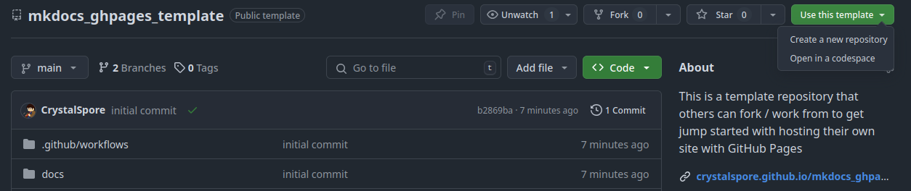
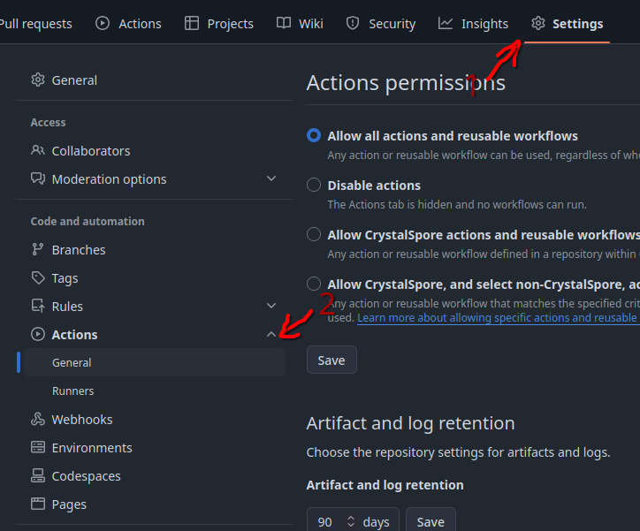
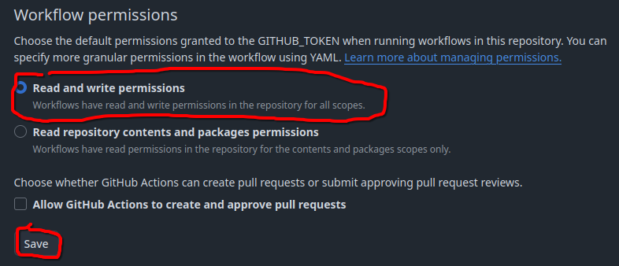

{ loading=lazy }

# Pre-requisites
- A Domain you already own (from a provider like Namecheap or Porkbun, etc)
- A GitHub account
    - GitHub will be hosting your "static" website for you
- Patience to learn a little bit of tech
    - I will walk through the process of setting up the site, & will attempt to clarify the docs if there are questions

# Terminology
To make talking about the process below, without needing to re-explain myself multiple times, I will provide a glossary for key terms & a brief synopsis of what these terms refer to:

- ***Git:*** A tool used for "Version Control". Version Control keeps the history of edits to documents over the course of time, to allow rollback if desired. You don't have to get too technical with this, & I will share the bare minimum needed to manage this
- ***GitHub / GitHub Actions:*** GitHub is a website that hosts Git "Repositories". In simple terms, this will hold the contents that will create your site, as well as the static website that people will browse
- ***DNS / Domain Name Registrar:*** How example.com gets converted into computer address space, which directs people to the correct page
- ***Mkdocs:*** (Pronounced as Make Docs) Officially used for making documentation for code, but can be used for making any static website. The page you are reading now was created using Mkdocs, & soon your website will be too!
- ***Python:*** The programming language Mkdocs is written in. You will not need to write any code, but you will need to install Python if you want to test your website locally before "pushing" your site up to GitHub

# Instructions

1. Go to the Template Repository [here](https://github.com/CrystalSpore/mkdocs_ghpages_template)
2. Select the green "Use this template" button, then select "Create a new repository"
    { loading=lazy }
3. On the next page that comes up, enter in the repository name (you can just do "MyWebsite" or something like that), then click Create Repository
4. Head to Settings -> Actions -> General, then scroll down & change Workflow Permissions from "Read" to "Read & Write"
    
    
5. Under the docs directory, create any folders & files that you want. The directory structure under this folder determines your website's structure. (Note: The example site includes a `.pages` file, which limits the number of pages shown, and/or allows for renaming the pages. You can delete this file to get the default auto population for the navbar)

# What format are the Pages?
Mkdocs uses Markdown. If you have used formatting in Discord or Slack before, you have used a form of Markdown. You can look at a Markdown "cheat sheet" [here](https://www.markdownguide.org/cheat-sheet/). Mkdocs & it's plugins add some extra features, but this will get you 90% of the way there.

# Customizing
For basic customization, look at the [Mkdocs Catalog](https://github.com/mkdocs/catalog?tab=readme-ov-file#-theming) to select a them that works best for you. You will then need to edit the `mkdocs.yml` file, & edit the components under the `theme` block to match your newly chosen theme.

# Personal Domain
Edit the `CNAME` file under the docs directory, & replace `example.com` with your domain. Then you need to follow *Step 5 Only* of [these docs](https://docs.github.com/en/pages/configuring-a-custom-domain-for-your-github-pages-site/managing-a-custom-domain-for-your-github-pages-site#configuring-an-apex-domain) from GitHub. (This should lead you to "Configuring an Apex Domain"). If everything is set up correctly, you should have the site available via your domain shortly!